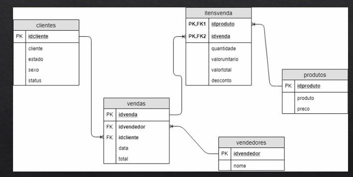
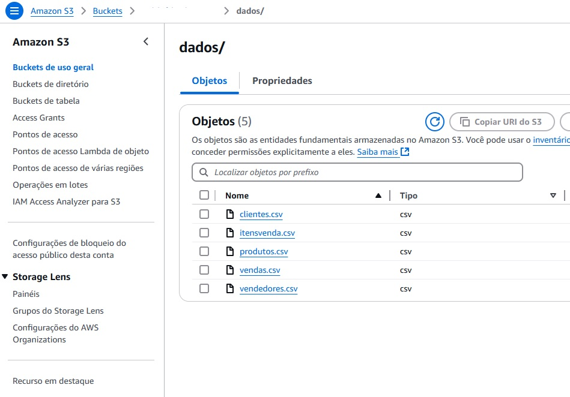
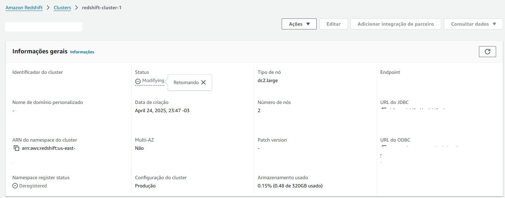
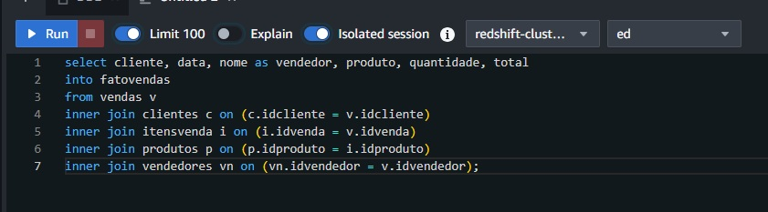

# Projeto: Data Warehouse na AWS com Redshift e Looker Studio

Este projeto demonstra uma arquitetura de Data Warehouse na AWS utilizando o Amazon Redshift para ingestão e consulta de dados armazenados no Amazon S3. O objetivo é permitir a análise ad hoc de dados através de dashboards no Looker Studio (antigo Google Data Studio).

---

## 🔧 Tecnologias e Serviços Utilizados

- Amazon Redshift
- Amazon S3
- IAM (papéis e permissões)
- SQL (COPY, criação de tabelas)
- Looker Studio (conexão com Redshift)

---

## 🎯 Objetivo

O projeto consiste em:

1. Armazenar arquivos CSV com dados de vendas em um bucket S3.
2. Criar um cluster Redshift e conectar ao S3 para ingestão dos dados com o comando `COPY`.
3. Criar uma tabela desnormalizada para facilitar análises ad hoc.
4. Conectar o Redshift ao Looker Studio para construção de dashboards.  


Segue o modelo de dados:


---

## 🗂️ Estrutura de Pastas

- `sql/`: Scripts SQL para criação e carga de tabelas.
- `imgs/`: Prints de telas da AWS, diagrama da arquitetura e dashboards criados.
- `datasets/`: Exemplo (ou amostra) do dataset utilizado.

---

## 📥 Etapas do Projeto

### 1. Criação do Bucket S3
- Nome único e acesso público bloqueado
- Upload dos arquivos CSV de vendas




---

### 2. Criação do Cluster Redshift
- Tipo: dc2.large
  - ⚠️ Este tipo será descontinuado em abril de 2026
    - Recomenda-se usar RA3 ou Redshift Serverless
- Criação de banco de dados e tabelas
- Lembre-se de configurar sua security credentials para permitir integração entre Redshift e ferramentas de BI.



---

### 3. Criação de Tabelas SQL no Editor de Consultas Redshift
Script para criação das tabelas que iremos utilizar está na pasta scripts
 - 1.CreateTable

---

### 4. Comando COPY
Script para carregar os dados do S3 para o Redshift:
Abaixo um exemplo geral: Usando apenas uma tabela como base.

```sql
COPY vendas
FROM 's3://meu-bucket/vendas.csv'
'aws_access_key_id='
'aws_secret_access_key='
region 'yyyy'
delimiter ';'
DATAFORMAT 'DD/MM/YYYY'
IGNOREHEADER 1;
```

---

### 5. Desnormalizar Tabelas
Script para desnormalizar as tabelas e tornar consultas com queries menos complexas.


---

### 5. Conectando ao Looker
- Faça o login no Looker
- Connect os dados com o Amazon RedShift
- Uma vez os dados carregados, podemos criar análises, visualizações Ad Hoc de forma rápida, fácil e interativa. 
